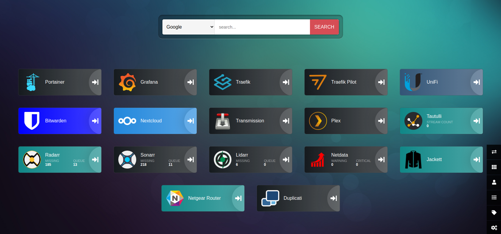

# Docker Pi-Stacks

## Introduction
This repository contains curated stacks of useful Docker containers optimized for the Raspberry Pi &mdash; primarily geared toward media/entertainment.

Many of the containers will require additional configuration upon first use, but after everything is configured, you can easily migrate somewhere else provided you keep a backup of your config directory.

Once configured, you'll be able to organize all of your containers neatly using Heimdall. For example, my "home page" looks like this:



The best thing is, this setup integrates Duck DNS and Traefik so you don't have to memorize IP addresses and port numbers, and uses SSL certificates from Let's Encrypt to keep everything secure. Additionally, you can conveniently authenticate only once for many of the containers by leveraging [OAuth 2](documentation/0-oauth2.png) and signing in with GitHub (or any other supported Oauth 2 provider).

> **_NOTE:_**  During the initial setup you may need to uncomment the ports to configure the various microservices. Once everything is fully configured, Traefik will neatly route everything so you only need to keep 2 ports open (80 and 443).

---

## Getting Started:
Clone this repo, then create a [.env file](.env) and place it into the pi4-stack directory (in the same directory as the docker-compose.yml). Paste the following content into the .env file and input/change variables according to your preferences.

```bash
# General / common settings
PUID=1000
PGID=1000
TZ=America/Los_Angeles
USERDIR=/home/pi
EXTHDD_DIR=/mnt/hdd
CONFIG_DIR=/mnt/hdd/docker/config
VOLUME_DIR=/mnt/hdd/docker/volume

# Username you want to use for (nearly) everything
USERNAME=

# Duck DNS / Let's Encrypt / Traefik
FQDN=example1.duckdns.org
DUCKDNS_SUBDOMAINS=example1,example2
DUCKDNS_TOKEN=

# Nextcloud and database config
POSTGRES_USER=
POSTGRES_PASSWORD=
NEXTCLOUD_PASSWORD=

# Transmission-VPN
OPENVPN_USERNAME=
OPENVPN_PASSWORD=

# Used for OAuth 2 authentication
# https://pusher.github.io/oauth2_proxy/auth-configuration
GITHUB_ORG=
GITHUB_OAUTH_CLIENT_ID=
GITHUB_OAUTH_CLIENT_SECRET=
# Just use a random password to encrypt the cookie
OAUTH2_PROXY_COOKIE_SECRET=


# Not currently used
#EMAIL_FROM=
#EMAIL_TO=
#EMAIL_PASSWORD=
#HTTP_USERNAME=
#HTTP_PASSWORD=
#TRANSMISSION_USERNAME=
#TRANSMISSION_PASSWORD=
```

Ideally you should fully configure Traefik before launching any containers. This is simple, just reference the included Traefik config files (config/traefik) and replace `***INSERT_FQDN***` and `***INSERT_EMAIL***` in `traefik.toml` with your own information.

---

## Launching containers:

1. To launch all the containers:
    ```
    docker-compose up -d
    ```

2. To launch an individual container, specify the service (for example: Radarr):
    ```
    docker-compose up -d radarr
    ```

3. To launch multiple containers, separate the services with spaces (for example: db1 and nextcloud):
    ```
    docker-compose up -d db1 nextcloud
    ```

---

> **_NOTE:_**  New containers are evaluated in the dev folder before graduating to the pi-stack. If there's something you want that isn't in the stack you can check for it in the dev folder and move it over.

> **_NOTE:_**  You could technically run this on various chipset architectures, but you'll have to change some of the images if you're not running on a Raspberry Pi or some other ARM-based computer.
